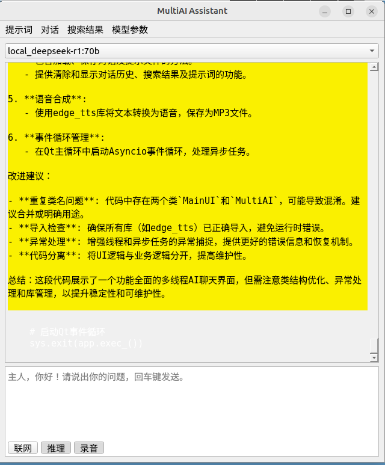

# MultiAI Assistant

A multi-model AI assistant desktop application supporting various large language models and web search capabilities, featuring an intuitive graphical interface.

 <!-- Replace with actual screenshot -->

## Key Features

- **Multi-Model Support**  
  Integrated cloud APIs including OpenAI, DeepSeek, Kimi, and local DeepSeek R1 series models
- **Smart Web Integration**  
  Real-time web search via Google Serper API to enhance response relevance
- **Conversation Management**  
  Supports saving/loading chat history, context clearing, and Markdown export
- **Text-to-Speech**  
  Built-in Edge-TTS engine for converting responses to MP3 audio
- **Parameter Customization**  
  Real-time adjustment of core parameters: temperature, max_tokens, etc.
- **Extended Interfaces**  
  Advanced features including prompt template management and quick model switching

## Requirements

- Python 3.8+
- Ollama local service (for local models)
- Valid API keys (see [Configuration](#configuration))

## Installation

1. Clone repository
```bash
git clone https://github.com/yourusername/MultiAI-Assistant.git
cd MultiAI-Assistant
```

2. Install dependencies
```bash
pip install -r requirements.txt
```

3. Configure environment variables  
   Create `.env` file with:
```ini
# API Keys
OPENAI_API_KEY=your_openai_key
DEEPSEEK_API_KEY=your_deepseek_key
KIMI_API_KEY=your_kimi_key
YUANBAO_API_KEY=your_yuanbao_key
SERPER_API_KEY=your_serper_key

# Proxy (optional)
PROXY_URL=http://your.proxy:port
```

## Usage Guide

### Basic Operations
- **Input Box**: Multi-line editing, `Shift+Enter` for new line, `Enter` to send
- **Functional Buttons**:
  - 📡 Web: Enable web search enhancement
  - 🧠 Think: Show model reasoning process
  - ⏺ Record: Enable TTS conversion
- **Model Switching**: Select AI models via top dropdown menu

### Menu Functions
- **Prompts**: Load/save system prompt templates
- **Conversation**: Manage chat history (save/load/clear)
- **Search Results**: View or clear web search content
- **Model Params**: Adjust generation parameters

## Configuration

### Required API Keys
| Service         | Environment Variable |
|-----------------|----------------------|
| OpenAI          | OPENAI_API_KEY       |
| DeepSeek        | DEEPSEEK_API_KEY     |
| Kimi            | KIMI_API_KEY         |
| Google Serper   | SERPER_API_KEY       |

### Local Model Setup
1. Install Ollama service
2. Pull desired model:
```bash
ollama pull deepseek-r1:32b
```
3. Keep Ollama running at `localhost:11434`

## Notes

1. TTS functionality requires system audio output
2. Web search limited to 100 free daily calls (Serper API)
3. Local model speed depends on hardware
4. Context memory varies between models

## License

[MIT License](LICENSE)

# MultiAI Assistant

多模型AI助手桌面应用程序，支持多种大语言模型与网络搜索功能，提供直观的图形交互界面。

 <!-- 可替换为实际截图 -->

## 主要功能

- **多模型支持**  
  集成 OpenAI、DeepSeek、Kimi云端API，支持本地DeepSeek R1系列模型
- **智能联网**  
  通过Google Serper API实时获取网络搜索结果，增强回答时效性
- **对话管理**  
  支持对话历史保存/加载、上下文清除、Markdown格式导出
- **语音合成**  
  集成Edge-TTS引擎，可将回答内容转为语音（MP3格式）
- **参数定制**  
  实时调整温度值（temperature）、最大生成长度（max_tokens）等核心参数
- **扩展接口**  
  提供提示词模板管理、模型快速切换等高级功能

## 环境要求

- Python 3.8+
- Ollama本地服务（如需使用本地模型）
- 有效的API密钥（见[配置说明](#配置)）

## 安装步骤

1. 克隆仓库
```bash
git clone https://github.com/yourusername/MultiAI-Assistant.git
cd MultiAI-Assistant
```

2. 安装依赖
```bash
pip install -r requirements.txt
```

3. 配置环境变量  
   创建`.env`文件并填入以下内容：
```ini
# API密钥配置
OPENAI_API_KEY=your_openai_key
DEEPSEEK_API_KEY=your_deepseek_key
KIMI_API_KEY=your_kimi_key
YUANBAO_API_KEY=your_yuanbao_key
SERPER_API_KEY=your_serper_key

# 代理配置（可选）
PROXY_URL=http://your.proxy:port
```

## 使用指南

### 基础操作
- **输入框**：支持多行编辑，`Shift+Enter`换行，`Enter`发送
- **功能按钮**：
  - 📡 联网：启用网络搜索增强
  - 🧠 推理：显示模型思考过程
  - ⏺ 录音：启用语音合成功能
- **模型切换**：通过顶部下拉菜单选择不同AI模型

### 菜单功能
- **提示词**：加载/保存系统提示模板
- **对话**：管理对话历史（保存/加载/清除）
- **搜索结果**：查看或清空网络检索内容
- **模型参数**：调整生成长度、温度值等核心参数

## 配置说明

### 必需API密钥
| 服务名称      | 环境变量名         |
|---------------|--------------------|
| OpenAI        | OPENAI_API_KEY     |
| DeepSeek      | DEEPSEEK_API_KEY   |
| Kimi          | KIMI_API_KEY       |
| Google Serper | SERPER_API_KEY     |

### 本地模型配置
1. 安装Ollama服务
2. 拉取所需模型：
```bash
ollama pull deepseek-r1:32b
```
3. 保持Ollama服务运行在`localhost:11434`

## 注意事项

1. 语音合成功能需要系统音频输出设备
2. 网络搜索功能每日有100次免费调用限额（Serper API）
3. 本地模型响应速度取决于硬件配置
4. 不同模型的上下文记忆长度可能不同

## 许可证

本项目采用 [MIT License](LICENSE)